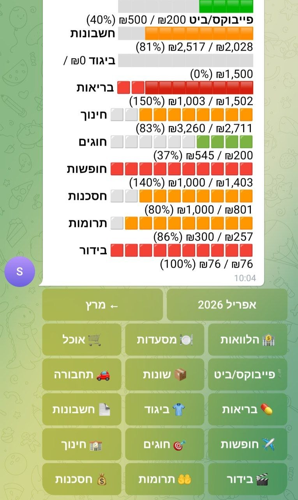

# Israeli Family Budget Bot

A self-hosted Telegram bot that automatically tracks spending across Israeli bank accounts and credit cards, categorizes transactions using AI, and provides real-time budget monitoring per category.



## What it does

- Scrapes transactions from **Isracard**, **Max**, and **Bank Hapoalim** on a schedule
- Auto-categorizes each transaction using merchant rules → Gemini AI → manual fallback
- Posts every new transaction to a **Telegram group** with an inline category keyboard
- Tracks monthly spending per budget bucket and shows a live progress bar on each message
- Supports `/status` for a full monthly breakdown with month navigation (← prev | current →)
- Supports `/budget` to view and edit budget amounts per category inline
- Drill down into any budget category to see individual transactions — each one is tappable to recategorize or ignore
- Mark any transaction as **ignored** (excluded from budget totals) with one tap
- When you recategorize a transaction, optionally apply the same category to all similar past transactions in one tap
- Handles multiple card holders (e.g. a couple) with per-owner labels

## Architecture

```
Cloud Scheduler (every 2h, Sun–Fri, Asia/Jerusalem)
        │  POST /scrape  or  POST /scrape-hapoalim
        ▼
Cloud Run: budget-bot (Node.js 22, always-on CPU)
        │
        ├── scraper.mjs        Puppeteer-based scraping via israeli-bank-scrapers
        ├── categorizer.mjs    Rules engine → Gemini 2.5 Flash → null (manual)
        ├── dedup.mjs          SHA-256 txn ID, skip already-seen in Firestore
        ├── budget.mjs         Monthly spend per bucket, Firestore-backed amounts
        ├── notifier.mjs       Telegram messages with inline keyboard
        └── index.mjs          Express: /scrape, /scrape-hapoalim, /webhook
                               /status and /budget Telegram commands
```

## Supported banks

| Bank / Card | Library scraper | Notes |
|-------------|-----------------|-------|
| Isracard    | `isracard`      | Multiple card holders supported |
| Max (Leumi Card) | `max`      | |
| Bank Hapoalim | `hapoalim`   | Requires OTP on first login; session persisted in Firestore |

Additional scrapers from [israeli-bank-scrapers](https://github.com/eshaham/israeli-bank-scrapers) can be added — see [Adding a new source](#adding-a-new-source) below.

## Tech stack

- **Node.js 22** (ESM `.mjs` modules)
- **[israeli-bank-scrapers](https://github.com/eshaham/israeli-bank-scrapers)** — Puppeteer-based bank scraping library
- **Google Cloud Run** — containerized deployment
- **Firestore** — transaction storage, dedup, rules, session cookies
- **Gemini 2.5 Flash** — AI categorization (free tier)
- **Telegram Bot API** — notifications and interactive UI
- **Cloud Scheduler** — periodic scrape triggers

## Categories and budget buckets

Categories are the core of how the system works — every transaction must belong to one. The category list is defined in `src/categories.mjs` and the budget buckets (which map one or more categories to a monthly amount) are defined in `src/budget.mjs`.

**You must customize both files before deploying** — the defaults reflect one family's spending structure and won't match yours. Typical changes:

- Edit `CATEGORIES` in `categories.mjs` to add, remove, or rename categories
- Edit `BUDGET_BUCKETS` in `budget.mjs` to set your own monthly amounts and category groupings
- Edit `src/seed-rules.mjs` to pre-populate merchant→category rules matching your spending patterns, then run `node src/seed-rules.mjs` once

Budget amounts can also be overridden at runtime via the `/budget` Telegram command without touching the code — those overrides are stored in Firestore and take precedence over the code defaults.

## Security & Privacy

### What access does this require?

The bot logs into your bank accounts using the same credentials you use in a browser. It uses [israeli-bank-scrapers](https://github.com/eshaham/israeli-bank-scrapers), a well-known open-source library that automates a real browser session — no unofficial APIs, no screen scraping tricks. It reads transaction history only; it cannot initiate transfers or modify anything.

Your credentials never leave your control: in the GCP setup they live in Secret Manager (encrypted at rest, accessible only to your Cloud Run service); in the local setup they stay in a `.env` file on your machine.

### What does GCP store?

If you use the Google Cloud deployment:
- **Firestore** stores your transactions, categorization rules, and budget amounts — in your own GCP project, not shared with anyone
- **Secret Manager** stores your bank credentials and Telegram token — encrypted, IAM-gated
- **Cloud Run logs** may contain transaction descriptions (merchant names, amounts) — be aware if you share GCP project access with others

### Can I run this without any cloud?

Yes. GCP is used for two things: **storage** (Firestore) and **hosting** (Cloud Run). Both are replaceable:

- **Storage**: Firestore can be swapped for a local SQLite database or even a JSON file with straightforward changes to `src/firestore.mjs` and the functions that call it
- **Hosting**: the bot runs fine as a local Node.js process (`node src/index.mjs`) — no deployment needed
- **Credentials**: without Secret Manager, credentials live in a local `.env` file that never leaves your machine

A fully local setup means: your credentials stay on your computer, your transactions stay on your computer, and nothing touches a third-party server except the bank websites and Telegram.

### What are the real risks?

- If your GCP project is compromised, an attacker gets your bank credentials
- If your local machine is compromised, same applies to the `.env` file
- The Telegram bot token gives full control of the bot — rotate it immediately if exposed (as you would with any API key)
- This project is self-hosted and community-maintained — review the code before trusting it with your credentials

**Bottom line**: if the idea of your bank credentials existing anywhere outside your own computer makes you uncomfortable, run it locally with a `.env` file and swap Firestore for local storage. The code is straightforward enough to make that change in an afternoon.

---

## Deployment options

### Option A — Google Cloud Run (recommended)

The full setup: bot runs 24/7, scrapes on a schedule, sends notifications automatically. Requires a GCP account with billing enabled (~$0–5/month on free tier). See **[LLM_STARTER.md](./LLM_STARTER.md)** for a complete step-by-step guide.

### Option B — Run locally from your computer

No cloud account needed. You run the bot manually whenever you want to fetch transactions. Good for trying it out or if you don't want ongoing infrastructure.

```bash
cp .env.example .env
# Fill in .env with your bank credentials and Telegram bot token

node src/index.mjs              # starts the bot (stays running, handles Telegram commands)
```

Then trigger a scrape by sending `/scrape` won't work in polling mode — instead curl:
```bash
curl -X POST localhost:8080/scrape           # fetch Isracard + Max
node src/scrape-hapoalim-local.mjs           # fetch Hapoalim (OTP via Telegram)
```

Or run a backfill for a past month:
```bash
node src/backfill.mjs --month=2026-03
```

**Caveats:** The bot process must be running to receive Telegram button taps (category selection, /status, etc.). If you close the terminal, the bot stops. You can leave `node src/index.mjs` running in the background or use a tool like `pm2` to keep it alive.

> ⚠️ Don't run locally while Cloud Run is also active — polling mode clears the webhook and breaks the cloud deployment.

## Getting started

## Local development

```bash
# Requires Node.js 22+
cp .env.example .env
# Fill in .env with your credentials

node src/index.mjs              # starts bot in polling mode on port 8080
curl -X POST localhost:8080/scrape          # trigger card scrape
curl -X POST localhost:8080/scrape-hapoalim # trigger Hapoalim scrape (OTP required first time)
node src/scrape-hapoalim-local.mjs          # run Hapoalim scrape locally (OTP via Telegram /otp)
```

## Project layout

```
src/
  index.mjs                   Express server + all Telegram command/callback handlers
  config.mjs                  Scrape profiles and environment variable loading
  scraper.mjs                 Puppeteer browser management + scrapeAll()
  pipeline.mjs                Orchestrates scrape → categorize → save → notify
  categorizer.mjs             Rules → Gemini → null fallback
  dedup.mjs                   Firestore dedup, transaction persistence, updateCategory/updateIgnored
  notifier.mjs                Telegram message formatting and sending
  budget.mjs                  ⚙️  Monthly budget bucket definitions and amounts — customize this
  status.mjs                  /status command: summary + drill-down + month navigation
  budget-ui.mjs               /budget command message builder
  categories.mjs              ⚙️  Category list and emoji map — customize this
  hapoalim-otp.mjs            Firestore-based OTP relay (Cloud Run ↔ Telegram /otp command)
  firestore.mjs               Firestore client singleton
  seed-rules.mjs              ⚙️  One-time: populate merchant→category rules — customize and run once
  backfill.mjs                Utility: fetch historical transactions for a past month
  recategorize-paybox.mjs     Utility: bulk-recategorize transactions by description pattern
  recategorize.mjs            Utility: backfill null-category transactions via Gemini
  repost.mjs                  Utility: re-post transactions with updated UI
  scrape-hapoalim-local.mjs   Interactive Hapoalim OTP login script
israeli-bank-scrapers/        Cloned library (built during Docker image build)
```

Files marked ⚙️ are the ones you need to customize for your own household before deploying.

## Adding a new source

The bot supports any bank or credit card that [israeli-bank-scrapers](https://github.com/eshaham/israeli-bank-scrapers/blob/master/src/definitions.ts) supports. Adding one takes three steps:

### 1. Find the scraper ID

Check the `CompanyTypes` enum in the library:
```
leumi, hapoalim, discount, mizrahi, max, isracard, amex, visaCal, beinleumi, ...
```

### 2. Add credentials to `.env`

```bash
# .env (local) — pick any variable names you like
MY_BANK_USER=myusername
MY_BANK_PASS=mypassword
```

For Cloud Run, add them to Secret Manager and the `--set-secrets` flag in your deploy command:
```bash
echo -n "myusername" | gcloud secrets create MY_BANK_USER --data-file=-
echo -n "mypassword" | gcloud secrets create MY_BANK_PASS --data-file=-
```

### 3. Add a profile in `src/config.mjs`

```js
{
  name: 'my-bank',              // internal key — stored in Firestore, never change after first run
  displayName: 'שם בעברית',    // shown in Telegram messages
  company: 'leumi',             // CompanyTypes key from israeli-bank-scrapers
  credentials: {
    username: process.env.MY_BANK_USER,
    password: process.env.MY_BANK_PASS,
  },
},
```

Profiles with any `undefined` credential field are automatically skipped at startup, so it's safe to define a profile before the secrets are added.

### OTP / two-factor banks

If the new scraper requires OTP (like Hapoalim), the existing `hapoalim-otp.mjs` watcher already handles any bank that shows an OTP page — it detects the page automatically, sends a Telegram prompt, and waits for `/otp [code]`. No additional code is needed.

### After adding

Redeploy and trigger a manual scrape to verify:
```bash
gcloud run deploy budget-bot --source . --region=europe-west1
curl -X POST $SERVICE_URL/scrape
```
